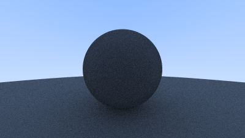
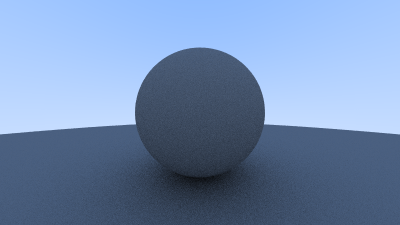

# Ray-Tracer

A high-performance ray tracer written in modern C++20, designed to render complex 3D scenes with realistic lighting, materials, and textures. This project demonstrates advanced systems-level programming, multithreading, and low-level memory management, with a strong focus on performance optimization and clean software design.

---

## Project Overview

This ray tracer is a personal exploration of computer graphics and systems programming. It supports a wide variety of surface types (matte, reflective, emissive, transparent, and image-mapped), and is engineered for speed and scalability. The codebase leverages modern C++ features, multithreading, and memory-mapped I/O to efficiently render high-quality images.

**Key technical highlights:**
- **C++20:** Extensive use of modern language features, including `constexpr`, template metaprogramming, and strong type safety.
- **Multithreading:** Spatial tiling and thread-safe memory-mapped I/O for efficient parallel rendering.
- **Performance:** Bounding Volume Hierarchy (BVH) for fast ray-object intersection, compile-time scene configuration, and aggressive compiler optimizations.
- **Graphics:** Realistic materials, procedural and image-based textures, depth of field, and volumetric effects.

---

## Features

- **Complex Scene Rendering:** Supports matte, reflective, emissive, transparent, and image-mapped materials for photorealistic scenes.
- **Performance Optimizations:** BVH reduces ray intersection tests by ~70%, dramatically improving render times.
- **Multithreaded Spatial Tiling:** Divide-and-conquer approach partitions the scene into tiles, distributing work across CPU cores (5x speedup on 6-core CPUs).
- **Memory-Mapped I/O:** Enables thread-safe, lock-free pixel writes for concurrent rendering.
- **Compile-Time Computations:** Uses `constexpr` and templated structs for scene configuration, minimizing runtime overhead.
- **Procedural & Image Textures:** Includes Perlin noise, checkered, striped, and image-mapped textures.
- **Advanced Camera:** Adjustable FOV, arbitrary movement/orientation, and depth of field.
- **Volumetric Effects:** Constant density volumes for smoke/fog.
- **Multiple Geometric Primitives:** Spheres, parallelograms, and boxes with support for translation and rotation.

---

## Design Decisions

- **Spatial Tiling vs. Sample-Based Multithreading:** Chose spatial tiling for deeper exploration of concurrency and memory management, despite increased complexity.
- **Memory-Mapped I/O:** Used `mmap` for lock-free, thread-safe image output, trading higher setup cost for runtime efficiency.
- **BVH Optimization:** Reduced intersection complexity from O(n) to O(log n) for large scenes.
- **Compile-Time Scene Configuration:** Leveraged template metaprogramming to eliminate runtime branching for static scenes.

---

## Challenges & Lessons Learned

- **Concurrency Trade-Offs:** Spatial tiling and memory-mapped I/O required careful profiling and debugging to balance setup cost and runtime speed.
- **Compile-Time Programming:** Designing `constexpr` structs and templates deepened my understanding of C++20 metaprogramming.
- **Performance Profiling:** Used Valgrind and `std::chrono` to identify and resolve bottlenecks, especially in memory access and threading.
- **Systems-Level Thinking:** Gained experience with low-level OS features (e.g., `mmap`) and their impact on performance and portability.

---

## Technical Skills Demonstrated

- Modern C++ (C++20), template metaprogramming, and compile-time programming
- Multithreading, concurrency, and lock-free programming
- Memory-mapped file I/O and systems programming (POSIX)
- Performance profiling and optimization
- Computer graphics: ray tracing, BVH, procedural textures, and physically-based rendering

---

## Dependencies

- C++20 compiler (GCC 10+, Clang 10+)
- CMake 3.1+
- POSIX-compliant system (Linux, macOS; required for `mmap`)

---

## Installation

This project uses CMake and is compatible with Unix-based systems.

---

## Cloning

```sh
git clone https://github.com/robertoeg97/Ray-Tracer.git
```

---

## Building and Running

**Debug build:**
```sh
cd Ray-Tracer
mkdir debug
cd debug
cmake -DCMAKE_BUILD_TYPE=Debug ..
cmake --build .
./ray-tracer <image-filename>
```

**Release build:**
```sh
cd Ray-Tracer
mkdir release
cd release
cmake -DCMAKE_BUILD_TYPE=Release ..
cmake --build .
./ray-tracer <image-filename>
```

---

## Usage

Run the executable with an output image filename (e.g., `output.ppm`). The ray tracer renders a predefined scene (configurable in code) and saves the result in PPM format.

---

## Example Renders

Below are some example images produced by the ray tracer, demonstrating its features and progression:

| Feature | Example |
|---------|---------|
| Background Gradient |  |
| Single Red Sphere |  |
| Surface Normal Shading |  |
| Antialiasing |  |
| Diffuse Materials |  |
| Depth-Limited Reflections |  |
| Shadow Acne Fix |  |
| Correct Lambertian Scattering |  |
| Metal Surfaces |  |
| Fuzzy Metals |  |
| Dielectric Materials |  |
| Total Internal Reflection |  |
| Hollow Glass (Schlick Approximation) |  |
| Adjustable FOV |  |
| Moveable Camera |  |
| Camera Zoom |  |
| Depth of Field |  |
| Multiple Spheres |  |
| Moving Objects |  |
| Checkered Textures |  |
| Multiple Scenes |  |
| Image-Mapped Textures |  |
| Perlin Noise Textures |  |
| Smoothed Perlin Noise |  |
| Hermite Cubing |  |
| Scalable Perlin Noise |  |
| Shifted Perlin Noise |  |
| Perlin Turbulence |  |
| Striped Texture |  |
| Parallelograms |  |
| Emissive Materials |  |
| Multiple Light Sources |  |
| Cornell Box |  |
| Boxes |  |
| Translation & Rotation |  |
| Volumetric Effects |  |
| Complex Scene |  |

---
