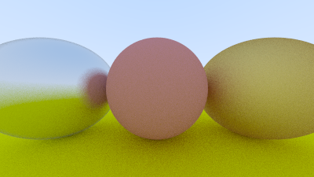
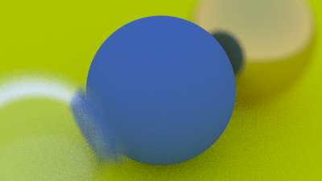
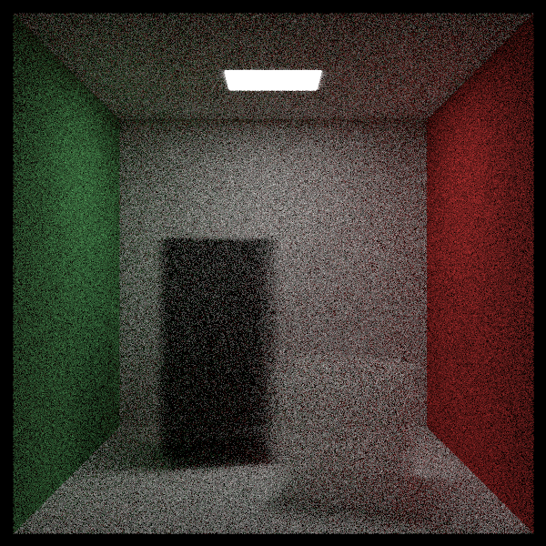

# Ray-Tracer

This project implements a ray tracer following the Ray Tracing in One Weekend book series: https://raytracing.github.io/

## Instructions

This project relies on the mmap functionality to enable multithreading. As a result, it will not be compatible with non-Unix operating systems.

### Cloning

1. In  a terminal, navigate to the directory where you would like to clone the project.

2. `git clone https://github.com/robertoeg97/Ray-Tracer.git`

### Generate and run Debug Build Files

```
cd Ray-Tracer
mkdir debug
cd debug
cmake -DCMAKE_BUILD_TYPE=Debug ..
cmake --build .
./ray-tracer <image-filename>
```

### Generate and run Release Build Files

```
cd Ray-Tracer
mkdir release
cd release
cmake -DCMAKE_BUILD_TYPE=Release ..
cmake --build .
./ray-tracer <image-filename>
```


## Images

Background Gradient


Single Red Sphere


Coloring RGB based on components of surface normal 


Antialiasing Added


Added Diffuse (Matte) Materials


Added Depth Limit to number of reflections


Removed Shadow Acne


Lambertian scattering is now properly probabilitically weighted towards the normal


Added Metal Surfaces


Added Fuzzy Metals




Added basic Dielectric Materials


Added Total Internal Reflection to Dielectric Model


Trick: Glass Sphere within a glass sphere gives a hollow sphere.

Added random Dielctric reflection via reflectance : Schlick approximation.


Added adjustable FOV


Added ability to move and orient camera arbitrarily


Zoomed in


Added Depth of Field/Defocus Blur




Cool Render


## A Note on Performance

At this point, I implemented multithreading.
A rough benchmark rendering the above image on a 6 core PC 
has the above render taking ~1831 seconds before adding multithreading, 
and ~473 seconds after adding multithreading, 
for a speedup of ~3.87.

## More Images

Added object movement


At this point, I implemented a Bounding Volume Heirarchy to increase Performance.

Added Texture interface, with solid color and checkered texture implementations. 


At this point, I implemented the ability to add multiple scenes.

Due to previous design decisions, this had to be compile-time information, so template meta-programming was used.


Added ability to make textures mapped to images.


Added Perlin Textures: Hash based random tiling


Added Interpolation to smooth image


Added Hermite Cubing to for even more smoothing


Added ability to scale the frequency of the Perlin noise


Added shifting when generating noise, to reduce the blocky appearance


Added Turbulence: Weighted sum of multiple frequencies of the hash


Added striped texture using the Perlin noise


Added Ability to Render Second Geometric Primitive: Parallelograms


Added Light Emitting Material


Two Light Sources


Cornell Box Scene


Implemented generic Box out of Quad primitives


Implemented Classes for Arbitrary Rotation and Translation of Objects


Added constant density volumes as Hittable objects




Cool Render

